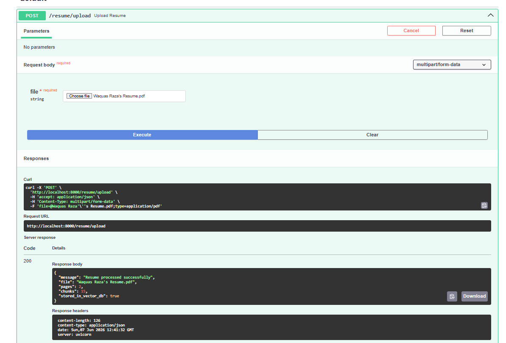
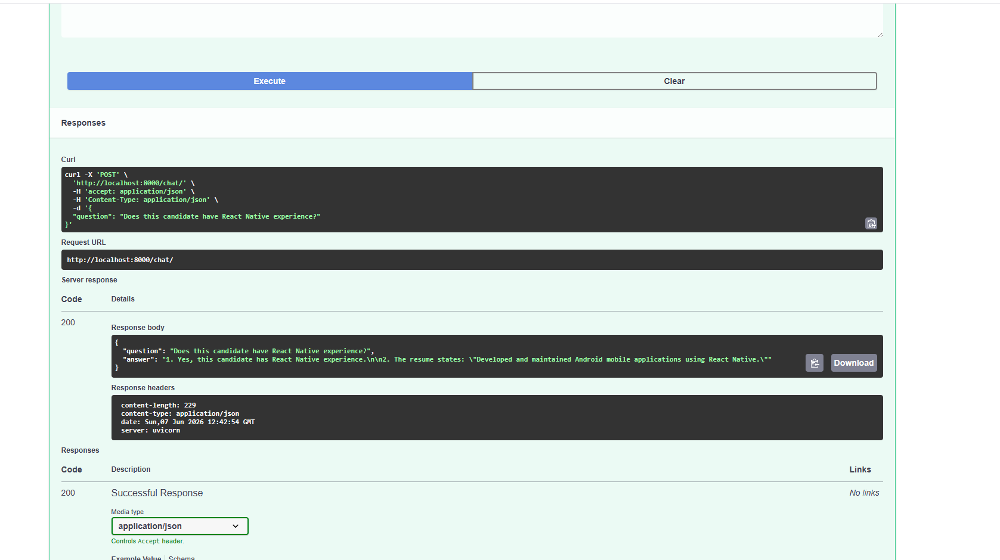

# Resume Screening RAG

An AI-powered Resume Screening System built using FastAPI, LangChain, OpenAI, and ChromaDB.

## Overview

This project enables recruiters and hiring managers to upload resumes, perform semantic search, and ask natural language questions about candidate profiles using Retrieval-Augmented Generation (RAG).

Instead of manually reviewing resumes, recruiters can query candidate information and receive AI-generated answers backed by relevant resume content.

## Features

* PDF Resume Upload
* Resume Text Extraction
* Intelligent Chunking
* OpenAI Embeddings
* ChromaDB Vector Storage
* Semantic Retrieval
* GPT-Powered Question Answering
* FastAPI REST APIs

## Tech Stack

### Backend

* Python
* FastAPI

### AI Stack

* LangChain
* OpenAI GPT-4o-mini
* OpenAI Embeddings

### Vector Database

* ChromaDB

### Document Processing

* PyPDFLoader

## System Flow

Resume Upload
→ PDF Extraction
→ Text Chunking
→ Embedding Generation
→ ChromaDB Storage
→ Semantic Retrieval
→ GPT Response

## API Endpoints

### Upload Resume

POST /resume/upload

Uploads and processes a resume into the vector database.

### Ask Questions

POST /chat

Allows recruiters to ask questions about uploaded resumes.

Example:

Question:
Does this candidate have FastAPI experience?

Answer:
Yes. The candidate has experience building backend APIs using FastAPI.

## Example Questions

* Does this candidate know FastAPI?
* Does this candidate have React Native experience?
* What projects has this candidate worked on?
* Does this candidate have leadership experience?
* Summarize this candidate's profile.

## Learning Outcomes

This project demonstrates:

* Retrieval-Augmented Generation (RAG)
* Vector Databases
* Embeddings
* Semantic Search
* Prompt Engineering
* LLM Integration
* AI Application Development

## Screenshots

### Resume Upload

### AI Answer

